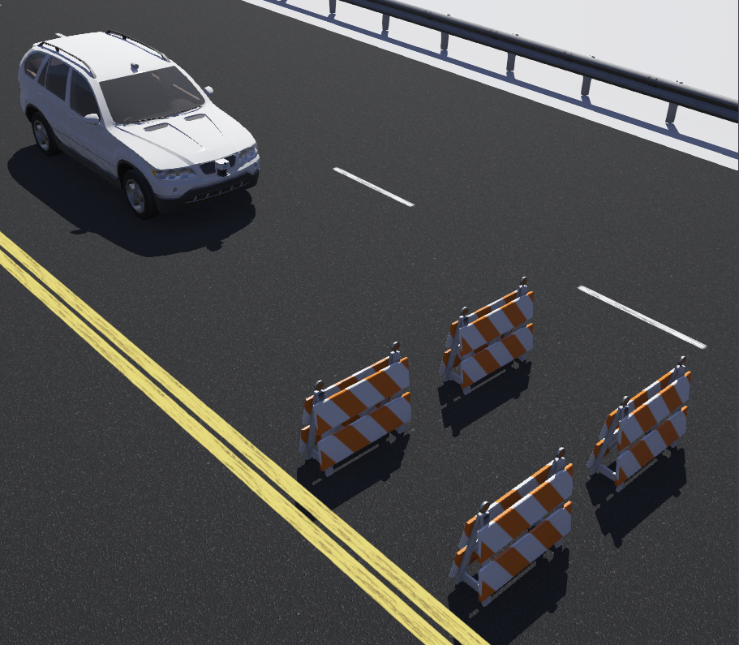

# Trajectory Deformation for AVs

     

Autonomous vehicles require robust planning algorithms to deal with uncertain environments. It is challenging to plan movements for unexpected traffic scenarios and ensure safety at the same time. A constant re-planning of the initial trajectories in real time is required to deal with detected adjacent obstacles either static or dynamic. Conventional approaches generate trajectories that do not abide to user preferences regarding the safety distance that the autonomous vehicle should keep from the obstacles on the road to avoid dangerous situations. An alternative is to generate new trajectories (lattices or tentacles) based on planned trajectories already available. Our algorithm takes into account Signal Temporal Logic (STL) formulas that represent the safety constraints imposed by the user in order to modify the invalid trajectories. The computational cost of our method is less than recalculating the complete trajectory from scratch, which is more convenient when there are not many rule violations near the goal region. We evaluate our approach in the robot simulator Webots, implementing planning, perception and navigation tasks, and considering different traffic scenarios involving obstacle avoidance and also re-planning. The efficiency of our method is demonstrated by comparing trajectories with STL constraints with trajectories planned without STL rules.

## What is it?

This is a python implementation of a motion planning algorithm.

## Requirements
For running the sample code:
- [Python](https://www.python.org/)
- [Webots](https://cyberbotics.com/)
